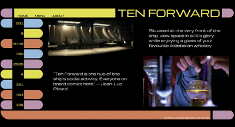

# Restaurant Page - Ten Forward

### Aims

- Use webpack with JS, CSS and HTML to create a website that dynamically renders the content.
- Use CSS to make the site look like a 'Star Trek - TNG' console.
- Make the desktop version responsive to size changes.

### Future Ideas

- Make the project responsive to mobiles and tablets.
- Add an indicator for which tab you are on.
- Create the side 'tabs' from a JS file, rather than manual CSS.
- Allow the side table to do something fun (e.g. take you to another trek-themed site)

_Inspired by 'The Odin Project'_
